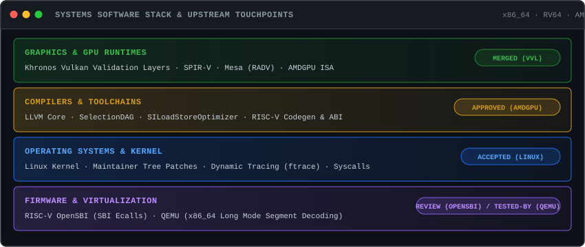

# Yudistira Putra

Systems Software Engineer working across compilers, GPU graphics drivers, operating system kernels, firmware, and virtualization. Focused on toolchain correctness, low-level ABI enforcement, GPU runtime validation, and memory safety.

  
  
  

---

## Upstream Contributions

| Target Subsystem | Technical Summary | Upstream Status |
| :--- | :--- | :---: |
| **Khronos Vulkan Validation Layers** | Fixed out-of-bounds static descriptor validation crash (`VVL-12294` / PR #12743). Added regression test coverage for descriptor set index boundary checking. | **Merged** |
| **LLVM Compiler Infrastructure (AMDGPU)** | Fixed invalid `SILoadStoreOptimizer` memory instruction merging on AMDGPU targets when Texture Fail Enable (TFE) or LOD Warning Enable (LWE) flags are active. | **Approved** *(Pending Merge)* |
| **Linux Kernel** | Upstream patch accepted into maintainer tree. | **Accepted** |
| **OpenSBI (RISC-V Firmware)** | Fixed buffer clamping boundary check in `sbi_ecall_get_extensions_str` (`0001-lib-sbi-clamp`). | **Pending Review** |
| **QEMU (Virtualization)** | Functional testing and bug isolation for x86 long mode segment prefix decoding (`#3391`). | **Tested-by** |
| **Bitcoin Core `libsecp256k1`** | Developed `ecc-audit-engine` differential testing and dynamic execution trace harness for C elliptic curve primitives. | **Contributor** |

---

## Subsystem Touchpoints

  

---

## Technical Focus

### Compilers & Toolchains
- **LLVM / Clang**: Backend code generation, target lowering, instruction selection (`SelectionDAG`), pass optimizations (`SILoadStoreOptimizer`), and `MachineVerifier` validation.
- **ABI & Calling Conventions**: Interprocedural signature optimization analysis, stack alignment, caller-saved register clobbering under dynamic tracing (`"patchable-function-entry"` / `ftrace`).
- **Target Architectures**: AMDGPU (RDNA / GFX9+), RISC-V (RV64GC), x86_64, AArch64.

### Graphics & GPU Drivers
- **Vulkan API & Validation**: Descriptor set validation, resource binding checks, out-of-bounds memory safety, and SPIR-V execution constraints in Khronos Validation Layers.
- **GPU Driver Stack**: AMDGPU vector memory instructions (TFE/LWE sampling), Mesa driver stack (RADV/ANV).

### Kernel, Firmware & Virtualization
- **Linux Kernel**: Tracing infrastructure, syscall handlers, memory management invariants, maintainer tree patches.
- **RISC-V OpenSBI**: Supervisor Binary Interface implementation, `ecall` handler safety, extension string buffer management.
- **QEMU**: User-mode and system-mode emulation, TCG instruction decoding, x86 segment prefix handling in 64-bit mode.

---

## Featured Repositories

- **[`Yudis-bit/ecc-audit-engine`](https://github.com/Yudis-bit/ecc-audit-engine)** — Dynamic differential testing, correctness verification, failure minimization, and trace runner for `secp256k1`.
- **[`Yudis-bit/Vulkan-ValidationLayers`](https://github.com/Yudis-bit/Vulkan-ValidationLayers)** — Fork containing descriptor set validation fixes and Vulkan validation test suite additions.
- **[`Yudis-bit/llvm-project`](https://github.com/Yudis-bit/llvm-project)** — Fork containing LLVM AMDGPU backend optimizations (`SILoadStoreOptimizer` TFE/LWE fixes) and RISC-V ABI patch series.
- **[`Yudis-bit/opensbi`](https://github.com/Yudis-bit/opensbi)** — Fork containing RISC-V SBI extension buffer safety patches.
- **[`Yudis-bit/arkheionx`](https://github.com/Yudis-bit/arkheionx)** — Local-first security review infrastructure and execution tracer for EVM bytecode.

---

## Contact & Links

- **Email**: pyudistira519@gmail.com
- **GitHub**: [Yudis-bit](https://github.com/Yudis-bit)
- **LinkedIn**: [yudistira-putra-dev](https://www.linkedin.com/in/yudistira-putra-dev/)
