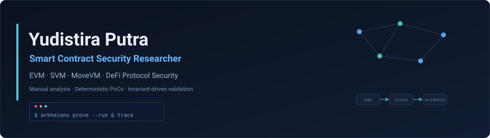
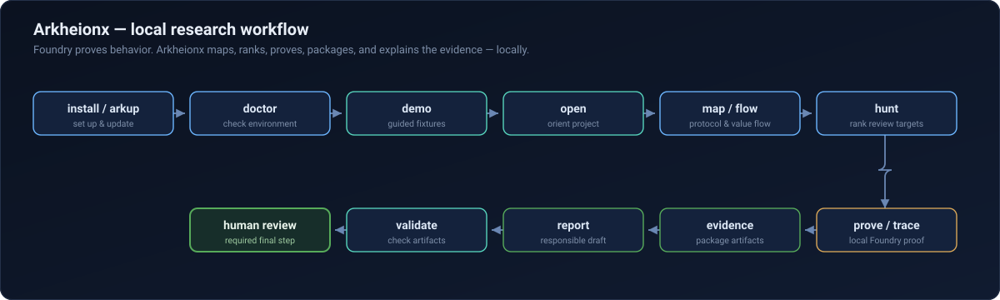
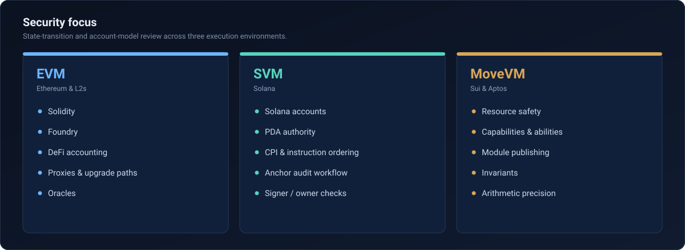
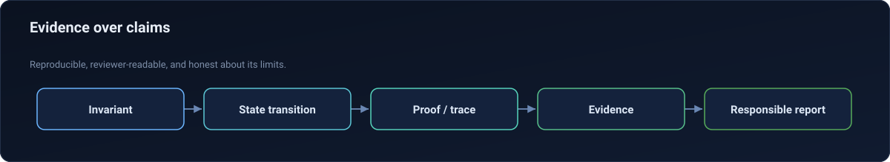

  

<h1 align="center">Yudistira Putra</h1>

  <b>Smart Contract Security Researcher</b> 
  EVM · SVM · MoveVM · DeFi Protocol Security · Builder of Arkheionx v3.0.0

<i>Manual, opcode-level analysis. Deterministic PoCs. Invariant-driven validation.</i>

  
  
  
  
  
  

---

## What I do

I work on protocol-level security: how value enters, moves through, and leaves a system, and which state transitions can break the assumptions a protocol depends on. The approach is evidence-first — invariants and hard assertions instead of surface-level checks, deterministic proofs of concept instead of screenshots, and reproducible execution traces instead of narrative.

Most of my work sits at the boundary between reading a protocol and proving something about it: re-engineering historical DeFi exploits as assertion-hardened PoCs, reviewing live protocols at the state-transition and account-model level across EVM, Solana/Anchor, and Move, and turning findings into reports a reviewer can actually reproduce and follow.

- Protocol mapping and value-flow analysis
- Invariant reasoning and assertion-hardened PoCs
- Local Foundry proof and execution-trace support
- Evidence-backed, reviewer-readable vulnerability reports

---

## Arkheionx — v3.0.0 (Public Stable Launch)

[`Yudis-bit/DeFi-Exploit-PoCs`](https://github.com/Yudis-bit/DeFi-Exploit-PoCs) is a Foundry-style local security workbench for DeFi protocol research. It turns a codebase you own or are authorized to review into a repeatable local workflow: a protocol map, a money-flow graph, a ranked review plan, a local Foundry proof path, and trace summaries, evidence packages, and responsible report drafts.

> Foundry proves behavior. Arkheionx helps researchers understand, prioritize, package, and explain the evidence — locally, with no RPC and no secrets.

  

**Core capabilities**

- **Protocol mapping** — roles, journeys, and where value is controlled
- **Value-flow review** — money-flow graph as JSON and Mermaid
- **Review-target ranking** — high-signal surfaces instead of guessing
- **Proof / trace workflow** — targeted local Foundry proofs and compact trace summaries
- **Evidence package** — structured proof and trace artifacts with explicit evidence levels
- **Responsible report draft** — local drafts labelled for human review
- **Artifact validation** — required-field and safe-transition checks on generated artifacts
- **Local-first install / update lifecycle** — `install.sh`, `arkup`, `uninstall.sh`
- **Guided demo fixtures** — `oracle-staking`, `amm-swap`, `lending-vault` (toy fixtures, not real protocols)
- **Professional CLI output** — restrained, TTY-gated color; JSON and files stay plain

Evidence levels stay explicit: `HEURISTIC → COMPILER_CONFIRMED → EXECUTION_CONFIRMED → EVIDENCE_READY`, with human review as the final, required step.

**Safety boundaries** — No RPC by default · no private keys or secrets · no live-chain mutation · no automated exploitation · human review required. Arkheionx is not an audit and does not promise vulnerability discovery, severity, or bounty eligibility.

---

## Technical focus

  

- **EVM (Ethereum & L2s)** — Solidity and Yul, state-transition reasoning, proxy and upgrade-path review, oracle and DeFi accounting, invariant fuzzing.
- **SVM (Solana)** — account-model validation, PDA authority and seed derivation, CPI ordering, Anchor-based audit workflow.
- **MoveVM (Sui & Aptos)** — resource safety, capabilities and abilities, module publishing, arithmetic precision and invariants.

---

## Validated Findings

External findings on live, in-scope programs, validated by the protocol teams. Listed without payout or severity details.

- **Variational — Oracle Registry Bypass.** State-transition flaw in oracle registration logic that allowed registry assumptions to be bypassed under specific call paths.
- **Hyperbridge — GET Timeout Prefix Mismatch.** Inconsistency between the encoded request prefix and the timeout-handler prefix on GET requests, breaking the symmetry the timeout path relied on.

---

## How I work

  

- **Evidence over claims** — proofs and traces, not assertions.
- **Reviewer-readable reports** — a reviewer can reproduce the steps and follow the path.
- **Invariant framing** — state what must always hold, then test against it.
- **Reproducibility** — deterministic, local artifacts that survive regression.
- **Proof / trace support** — Foundry execution backs the writeup where it can.
- **Responsible boundaries** — authorized scope only; human review is the final word.

---

## Tools

| Area              | Tools                                  |
| ----------------- | -------------------------------------- |
| EVM               | Solidity, Yul, Foundry, Hardhat        |
| Fuzzing / Formal  | Echidna, Medusa, Halmos                |
| Static Analysis   | Slither, custom Python tooling         |
| SVM               | Rust, Anchor, Solana CLI               |
| MoveVM            | Move, Sui CLI, Aptos CLI               |
| Infrastructure    | Python, Bash, GitHub Actions           |
| Research Workflow | traces, invariants, artifacts, reports |

---

## Featured projects

| Project | What it is |
| ------- | ---------- |
| **[Arkheionx](https://github.com/Yudis-bit/DeFi-Exploit-PoCs)** | Local DeFi security workbench — protocol mapping, value-flow analysis, proof/trace evidence, and report drafting. Stable at v3.0.0. |
| **[Arkheionx Guard](https://github.com/Yudis-bit/arkheoinx)** | Deterministic EVM execution firewall for Safe treasuries: an immutable guard core with timelocked policy and adapter registries bound by codehash pinning. Its Foundry invariant suite survived 512,000+ adversarial calls with zero ghost violations. |
| **[Cognitive Routing Protocol](https://github.com/Yudis-bit/Cognitive-Routing-Protocol)** | Prototype routing protocol for DePIN networks: a reinforcement-learning simulator (Python) with on-chain trust and incentive primitives (Solidity). Comparative simulation showed ~22% lower average latency on successful deliveries. |

---

## Current direction

- Post-v3 Arkheionx work (`v3.1.0`) — incremental workbench improvements after the stable cut.
- Local-first evidence workflows that keep findings honest about their evidence level.
- Deeper protocol understanding: clearer maps, better value-flow signal.
- Reusable review patterns that travel across protocols and execution environments.
- Research that stays reproducible and useful to the reviewer reading it.

---

## Contact

- **LinkedIn** — [yudistira-putra-dev](https://www.linkedin.com/in/yudistira-putra-dev/)
- **GitHub** — [Yudis-bit](https://github.com/Yudis-bit)

Open to: protocol security research, audit collaboration, bug bounty collaboration, DeFi security tooling, and smart contract security roles.

---

<i>"Security research should be reproducible, evidence-backed, and honest about its limits."</i>

