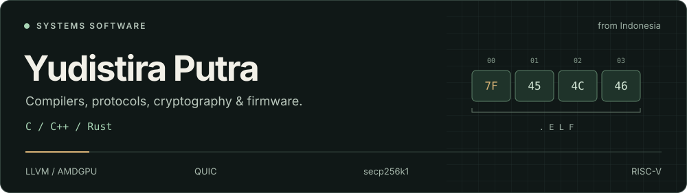

I fix compiler and memory-safety bugs, work on QUIC and RISC-V firmware, and write constant-time tests for cryptographic code.

### Merged upstream

| Project | Contribution |
|---|---|
| [LLVM / AMDGPU](https://github.com/llvm/llvm-project/pull/210583) | Blocked invalid TFE/LWE image-load merges; added MIR regression tests. |
| [Microsoft / MsQuic](https://github.com/microsoft/msquic/pull/6320) | Fixed reversed header-protection sample copying when receive batches split. |
| [Khronos / Vulkan Validation Layers](https://github.com/KhronosGroup/Vulkan-ValidationLayers/pull/12743) | Fixed an out-of-bounds read in static descriptor validation; added a regression test. |
| [Bitcoin Core / secp256k1](https://github.com/bitcoin-core/secp256k1/pull/1893) | Added constant-time coverage for `schnorrsig_sign_custom` and custom nonce callbacks. |
| [OpenSBI](https://github.com/riscv-software-src/opensbi/commit/f95648d3955d72f77e13315a990a6135303978a5) | Bounded SBI extension-list writes to buffer capacity; added a redzone test. |
| [Google / Kafel](https://github.com/google/kafel/pull/46) | Corrected the m68k `mseal` argument name from `size` to `flags`. |

**Get in touch** · [Email](mailto:pyudistira519@gmail.com) · [LinkedIn](https://www.linkedin.com/in/yudistira-putra-dev/)
