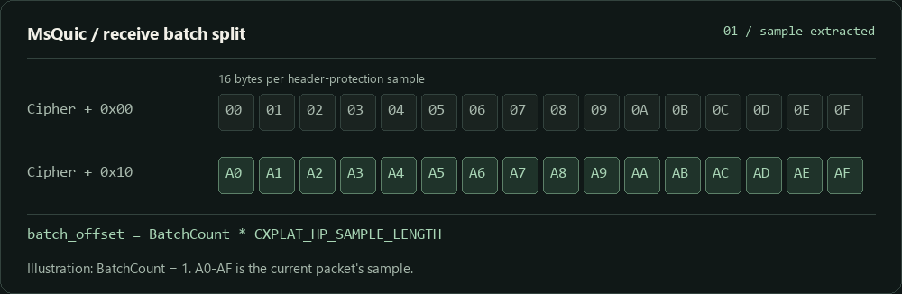

<picture>
  <source media="(max-width: 600px)" srcset="assets/systems-stack-mobile.svg">
  
</picture>

I'm a software developer in Indonesia, working mostly in C, C++ and Rust. I fix compiler and memory-safety bugs, work on QUIC and RISC-V firmware, and write tests for cryptographic code.

I like getting into the details: which byte got copied, where a buffer runs out of room, and whether a regression test catches the bug. I also build tools for inspecting bytes and reproducing failures.

[Email](mailto:pyudistira519@gmail.com) · [LinkedIn](https://www.linkedin.com/in/yudistira-putra-dev/) · [PR history](https://github.com/pulls?q=is%3Apr+author%3AYudis-bit)

---

### Work that landed upstream

| Project | What I changed |
| :--- | :--- |
| **[LLVM / AMDGPU](https://github.com/llvm/llvm-project/pull/210583)** | Prevented image-load merges that lose TFE/LWE status results. Added MIR regression tests for the affected ordering. |
| **[Microsoft / MsQuic](https://github.com/microsoft/msquic/pull/6320)** | Fixed reversed source and destination arguments when copying a header-protection sample after a receive batch splits. |
| **[Vulkan Validation Layers](https://github.com/KhronosGroup/Vulkan-ValidationLayers/pull/12743)** | Added a bounds check to stop descriptor validation reading past a smaller pipeline-layout binding. |
| **[Bitcoin Core / secp256k1](https://github.com/bitcoin-core/secp256k1/pull/1893)** | Added constant-time test coverage for `schnorrsig_sign_custom`, including custom nonce callbacks. |
| **[OpenSBI](https://github.com/riscv-software-src/opensbi/commit/f95648d3955d72f77e13315a990a6135303978a5)** | Bounded SBI extension-list writes to the caller's buffer. Added a redzone regression test. |
| **[Google / Kafel](https://github.com/google/kafel/pull/46)** | Corrected the m68k `mseal` argument name from `size` to `flags`. A small fix to the syscall policy definitions. |

### One patch, at byte level

When a MsQuic receive batch splits, the current packet's header-protection sample needs to move to offset zero for the next batch. The copy had its source and destination reversed. This is the buffer change behind [the fix](https://github.com/microsoft/msquic/pull/6320):

<picture>
  <source media="(prefers-reduced-motion: reduce)" srcset="assets/sample-copy.png">
  <source media="(max-width: 600px)" srcset="assets/sample-copy-mobile.gif">
  
</picture>

Illustrative byte values; each sample is 16 bytes. <a href="assets/sample-copy.png">Still frame</a> · <a href="tools/render-copy-demo.py">Animation source</a>

<strong>A few more details behind the patches</strong>

- **AMDGPU:** TFE/LWE image loads return an extra status word. The merge path didn't preserve it, and checking only the first instruction missed the ordinary-load → status-load ordering. The fix excludes these instructions while collecting merge candidates.
- **OpenSBI:** advancing a buffer offset by a name's nominal length could make the remaining capacity negative, then turn it into a large unsigned size for `sbi_snprintf`. The fix stops appending before the next name exceeds capacity; the test checks a redzone beyond a 16-byte buffer.
- **secp256k1:** functional signing tests and constant-time tests exercise different properties. The added CHECKMEM coverage reaches the custom signing entry point and nonce callback with secret-key material marked undefined, so Valgrind can catch its use in branches or memory addresses.

### On my desk

Recent patches cover Bitcoin script tests, QUIC connection-ID retirement, and getting constant-time tests into the regular secp256k1 test suites.

<strong>Open patches and review threads</strong>

 

| Project | Patch |
| :--- | :--- |
| Bitcoin Core | [Script recognition, sigop counting, opcode parsing and witness tests](https://github.com/bitcoin/bitcoin/pull/36360) that catch 12 individual mutations in `script.cpp`. |
| secp256k1 | [Run constant-time tests through CTest and `make check`](https://github.com/bitcoin-core/secp256k1/pull/1944); [test an invalid keypair alongside a valid one](https://github.com/bitcoin-core/secp256k1/pull/1937); [correct the window-size documentation](https://github.com/bitcoin-core/secp256k1/pull/1946). |
| MsQuic | [Validate `RETIRE_CONNECTION_ID` sequences and the packet's destination CID](https://github.com/microsoft/msquic/pull/6325), with regression tests through the frame receive path. |
| OpenSBI | [Bound RPMI shared-memory queue names and terminate the stored string](https://github.com/riscv-software-src/opensbi/pull/423). Review follows the project's mailing-list workflow. |
| Google / nsjail | [Stop setup when mount flags or the final remount fail](https://github.com/google/nsjail/pull/344). |
| Google / Kafel | [Align m68k and i386 syscall argument names](https://github.com/google/kafel/pull/47) so portable policies can use the same identifiers. |
| MCP conformance | [Stop retries when no input is requested](https://github.com/modelcontextprotocol/conformance/pull/498); [isolate the integer-range probe for custom headers](https://github.com/modelcontextprotocol/conformance/pull/499). |
| Circle / arc-node | [Reject mixed-case aliases of the same genesis account](https://github.com/circlefin/arc-node/pull/469), with collision tests and Hardhat coverage in CI. |

Open PRs checked on 1 October 2026. Links lead to the current review status.

### Things I'm building

| Project | What it's for |
| :--- | :--- |
| **[Bitpeek](https://github.com/Yudis-bit/bitpeek)** | Inspect bytes, file structures, endianness and binary diffs. The same core runs in the browser, CLI and a local MCP server. [Try it](https://bitpeek-seven.vercel.app). |
| **[ecc-audit-engine](https://github.com/Yudis-bit/ecc-audit-engine)** | Compare secp256k1 implementations against reference math, minimize failures and replay them. Includes dynamic-trace experiments with synthetic fixtures. |
| **[why-ui](https://github.com/Yudis-bit/why-ui)** | Let coding agents inspect actual browser behavior: find what's covering a button, trace it to local source and check the fix in the browser. |

I also keep a [routing simulation](https://github.com/Yudis-bit/Cognitive-Routing-Protocol) comparing a bandit-based router with Dijkstra across multiple seeds. It's a prototype; the experiments track delivery rate alongside latency.
